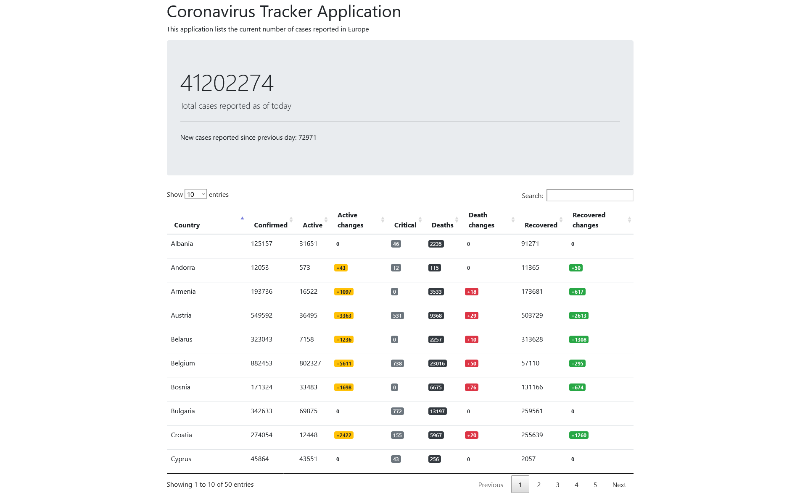

# Corona tracker

Minimal [Spring Boot](http://projects.spring.io/spring-boot/) corona tracker app for Europe.

##Application screenshots


## Requirements

For building and running the application you need:

- [JDK 1.8](http://www.oracle.com/technetwork/java/javase/downloads/jdk8-downloads-2133151.html)
- [Maven 4](https://maven.apache.org)

## Running the application locally

There are several ways to run a Spring Boot application on your local machine. One way is to execute the `main` method in the `com\corona\tracker\TrackerApplication.java` class from your IDE.

Alternatively you can use the [Spring Boot Maven plugin](https://docs.spring.io/spring-boot/docs/current/reference/html/build-tool-plugins-maven-plugin.html) like so:

```shell
mvn spring-boot:run
```

## Configuration table

   | Components  | Technology  | 
   | :---        |    :----:   |   
   | Frontend  | Materialize, Thymeleaf  | 
   | Backend   | Spring Boot 2.4+, Java 8 |
   | Security |  Spring Security, SSL|
   | Database | MySQL|
   | Server Build| Maven |
   | API testing| POSTMAN |
   | Tool | Intellj Idea, XAMPP|
   | Testing | JUnit5, Mockito|
   | Plugins | Lombok, Diffblue |

## Data Sources

* [disease.sh](https://corona.lmao.ninja/) - An open API for disease-related statistics.
